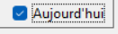

# GrassMan
Projet d'info première année CPP Valence, par Marine Prunel, Eric Durand, Nicolas Strekowski et Julie Andre.

# Trello
https://trello.com/invite/b/Uy4KVh03/ATTIb68c9ba514a800effa7acfc58a34aa70FA566FE7/grassman

# Lancer GrassMan

Verifiez que vous ayez bien python 3.12 + installé, et pip dans le PATH.

Double cliquez sur le fichier "SetupModulesAndLaunch", puis votre ordinateur téléchargera les bibliothèques requises au fonctionnement de l'appli et puis la lancera.

Après cette étape, il faudra cliquer sur "GrassMan" pour lancer l'application.

Note: Il ne faut pas fermer la console lors de l'execution, même après la fin des téléchargements, car comme python tourne sur la console, l'appli se fermera aussi.

Lien du GitHub: https://github.com/JESAISaps/GrassMan

# Documentation

Lors du lancement, une page s'ouvre, avec l'écran de connexion, et il faut deplacer la souris sur la droite pour afficher le menu de création de compte. Le bouton "Bloquer le menu" permet de faire en sorte que le menu ne se ferme pas si on sort la souris de la page.
Une fois le compte créé, vous pouvez vous connecter et créer un premier stade en choisissant le nombre de capteurs et leur position.
Vous pouvez maintenant accéder aux températures du jour, du mois précédent et de l'année.
Pour gérer les températures du jour avec l'arrosage et le chauffage, cliquez sur "aujourd'hui": 

Vous pouvez ensuite rendre visible les seuils de température conseillés et adapter votre gestion du stade à l'aide des prévisions.

Pour vous déconnecter, ou revenir à la liste des différents stades, il suffit de revenir dans le menu à droite. 